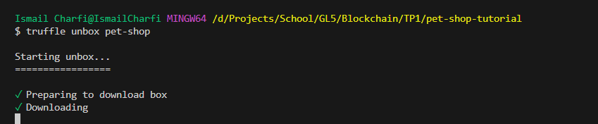
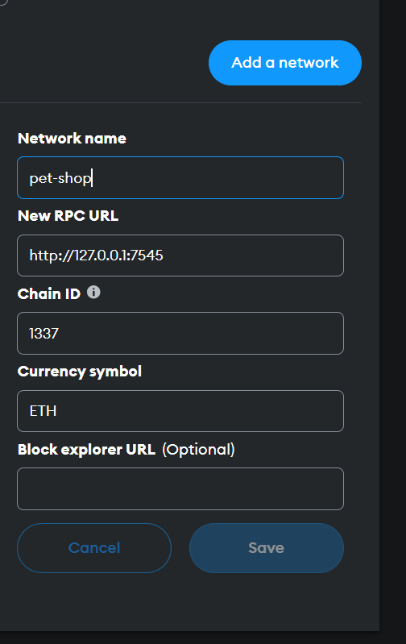

# tp1-blockchain-pet-shop

This Lab is a simple adoption tracking system for a pet shop, built as a decentralized application (Dapp) on the Ethereum blockchain. The Lab provides a hands-on experience on how to set up the development environment, create smart contracts, and build a user interface to interact with them.

## Setting up the Development Environment

Before getting started, make sure you have the following prerequisites installed:

- Node.js (v8+ LTS) and npm
- Git
- [Ganache](https://trufflesuite.com/ganache) - a personal blockchain for Ethereum development
- Truffle - Install it using the following command:

```bash
npm install -g truffle
```

You can verify that Truffle is installed by running the command:

```bash
truffle version
```


## Creating a Truffle Project

To create your Truffle project, initialize your Truffle project using the pet-shop Truffle Box:

```bash
truffle unbox pet-shop
```



Or you can clone this repository:

```bash
git clone https://github.com/IsmailCharfi/tp1-blockchain-pet-shop.git
```

## Compiling and Migrating the Smart Contract

### Compilation

This project uses Solidity which is a compiled language, so you need to compile your smart contract to bytecode for the Ethereum Virtual Machine (EVM) to execute. To compile your contracts, run:

```bash
truffle compile
```


### Migration

Now that your smart contract is compiled, it's time to migrate it to the blockchain. Before migrating, ensure that Ganache is running and generating a blockchain locally on port 7545.


Migrate the contract to the blockchain using the following command:

```bash
truffle migrate
```


## Testing the Smart Contract

You can test the smart contract by running the following command:

```bash
truffle test
```


## Interacting with the Dapp

To interact with the Dapp in your browser, you can use the MetaMask browser extension. Here's how:

1. Install [MetaMask](https://metamask.io/) in your browser.

2. Open MetaMask and click on "Add new network."




3. Start the local web server for the Dapp:

```bash
npm run dev
```


4. Connect MetaMask to your local blockchain and adopt.


5. Approve the connection to the Dapp in MetaMask.


## Demo


https://github.com/IsmailCharfi/tp1-blockchain-pet-shop/assets/73357703/f8bdeca3-32bd-488d-ab1b-4cad5abe953f

